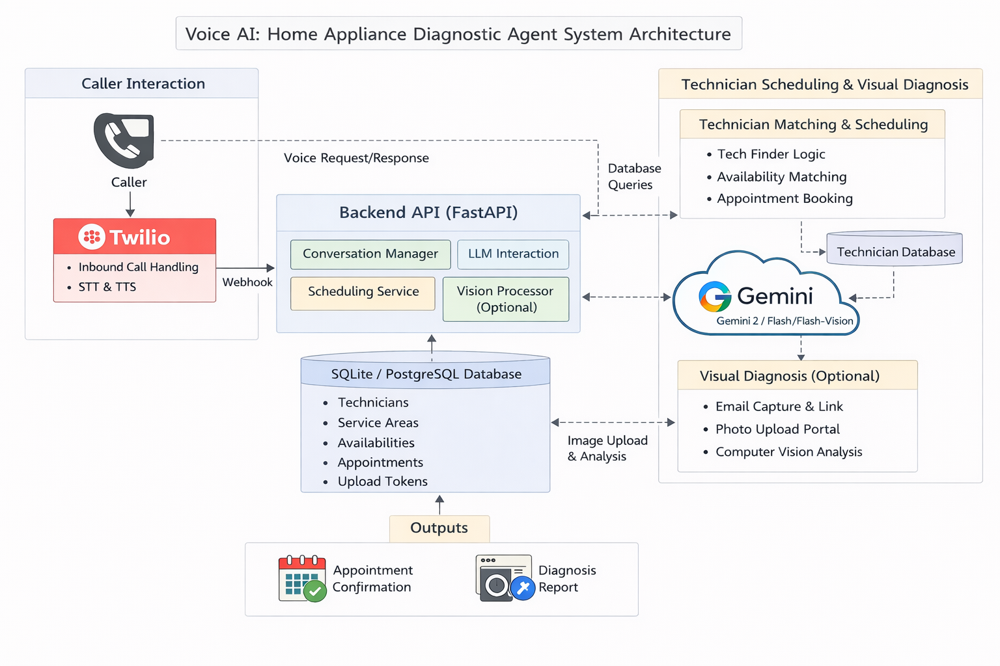

# Home Services - Voice AI Agent

An intelligent voice-based customer support agent for home appliance troubleshooting, built with FastAPI, Twilio, and Google Gemini AI.

## 🎯 Features

- **Voice Interaction**: Natural phone-based conversations via Twilio
- **AI-Powered Troubleshooting**: 3-tier support system using Gemini 2.5 Flash
- **Image Analysis**: Upload appliance photos for visual diagnosis
- **Smart Scheduling**: Automated technician appointment booking
- **Email Notifications**: SendGrid integration for upload links

## 🏗️ Architecture



## 🚀 Quick Start

### Prerequisites

- Docker & Docker Compose
- Twilio Account (with phone number)
- Google AI API Key (Gemini)
- ngrok (for local development)

### 1. Clone & Configure

```bash
git clone https://github.com/yourusername/shs-voice-ai-agent.git
cd shs-voice-ai-agent

# Create environment file
cp app/.env.example app/.env
# Edit app/.env with your API keys
```

### 2. Environment Variables

Create `app/.env`:

```env
GOOGLE_API_KEY=your_gemini_api_key
APP_BASE_URL=https://your-domain.ngrok-free.app
SENDGRID_API_KEY=your_sendgrid_key  # Optional
SENDGRID_FROM_EMAIL=noreply@yourdomain.com  # Optional

# MySQL credentials (for local development)
# Docker will override DB_HOST automatically
DB_HOST=localhost
DB_PORT=3306
DB_USER=voice_ai_user
DB_PASSWORD=voiceaipassword
DB_NAME=voice_ai
```

### 3. Launch with Docker (One Command!)

```bash
# Build and start both MySQL and the app
docker-compose up --build

# Or run in background
docker-compose up -d --build

# The setup will:
# ✅ Start MySQL 8.0 container
# ✅ Initialize database schema automatically
# ✅ Seed 20 technicians with availability
# ✅ Start the FastAPI app
# ✅ Handle 4+ simultaneous voice calls
```

**That's it!** The database is fully configured and ready for voice interactions.

### 4. Expose with ngrok (Development)

```bash
ngrok http 8000
# Copy the HTTPS URL to APP_BASE_URL in .env
```

### 5. Configure Twilio

1. Go to Twilio Console → Phone Numbers
2. Select your number → Voice Configuration
3. Set webhook URL: `https://your-domain.ngrok-free.app/twilio/voice`
4. Method: POST

### 6. Test

Call your Twilio phone number and describe an appliance issue!

## 📁 Project Structure

```
shs-voice-ai-agent/
├── app/
│   ├── main.py           # FastAPI application entry
│   ├── config.py         # Environment configuration
│   ├── db.py             # Database setup (SQLAlchemy)
│   ├── models.py         # Data models
│   ├── llm.py            # Gemini AI integration
│   ├── conversation.py   # Conversation state management
│   ├── twilio_routes.py  # Voice webhook handlers
│   ├── upload_routes.py  # Image upload endpoints
│   ├── image_service.py  # Image analysis service
│   └── seed.py           # Database seeding
├── Dockerfile
├── docker-compose.yml
├── requirements.txt
└── README.md
```

## 🎭 Support Tiers (Maps to Assignment Tiers 1-3)

### Tier 1: Conversational Troubleshooting (Assignment Tier 1)

- Appliance classification via Gemini LLM
- Common fixes (power cycle, check connections)
- No personal info required
- ~30 seconds resolution for simple issues

### Tier 2: Structured Diagnosis (Assignment Tier 2)

- Detailed symptom extraction
- Brand and model detection
- Model-specific troubleshooting steps
- Escalates to Tier 3 if unresolved

### Tier 3: Image-Based Analysis (Assignment Tier 3)

- Email collection with robust STT handling
- Photo upload via secure token link
- Gemini Vision analyzes appliance images
- Specific repair recommendations based on visual inspection

### Tier 4: Technician Scheduling (Bonus)

- ZIP code-based availability lookup
- Real-time slot booking with confirmation
- Fallback when AI troubleshooting insufficient

## � Service Coverage

**20 technicians** across **5 metro areas** covering **10 ZIP codes**:

| Metro Area    | ZIP Codes                  |
| ------------- | -------------------------- |
| Chicago       | 60115, 60601, 60602, 60611 |
| New York      | 10001, 10002, 11201        |
| San Francisco | 94105                      |
| Dallas        | 75201                      |
| Atlanta       | 30301                      |

**Appliance Specialties**: Refrigerator, Washer, Dryer, Dishwasher, Oven, HVAC

## �🔧 API Endpoints

| Endpoint                      | Method | Description               |
| ----------------------------- | ------ | ------------------------- |
| `/health`                   | GET    | Health check              |
| `/twilio/voice`             | POST   | Incoming call handler     |
| `/twilio/voice/continue`    | POST   | Conversation continuation |
| `/upload/{token}`           | GET    | Upload page               |
| `/upload/{token}`           | POST   | Image upload handler      |
| `/upload/status/{call_sid}` | GET    | Upload status check       |

## 🧪 Local Development (Without Docker)

```bash
# Create virtual environment
python -m venv venv
source venv/bin/activate  # or `venv\Scripts\activate` on Windows

# Install dependencies
pip install -r requirements.txt

# Run server
uvicorn app.main:app --reload --port 8000
```

## 📊 Database

**MySQL 8.0** with automatic initialization and connection retry logic.

### Docker Setup (Recommended)
- MySQL runs in a separate container
- Database schema auto-created via `init.sql`
- Persistent volume for data retention
- Health checks ensure MySQL is ready before app starts

### Local Development
```bash
# Make sure MySQL is running locally
# Update app/.env with your local credentials:
DB_HOST=localhost
DB_USER=your_mysql_user
DB_PASSWORD=your_mysql_password

# Run the app
uvicorn app.main:app --reload --port 8000
```

### Connection Resilience
- Automatic retry mechanism (5 attempts with 2s delay)
- Pool pre-ping to verify connections
- Connection recycling every hour

## 🔒 Security Notes

- API keys are loaded from environment variables only
- `.env` files are excluded from Docker images
- Sensitive data never logged in production
- Upload tokens expire after 24 hours

## 📞 How to Review This Submission

**Live Demo Phone Number:** `[YOUR_TWILIO_NUMBER]` *(update before submission)*

**Uptime Window:** Available during business hours (9 AM - 6 PM CST) or by request.

### Suggested Demo Script

1. **Call the number** and wait for greeting
2. **Say:** "My refrigerator is making a loud noise"
3. **Follow Tier 1-2 prompts** (appliance classification, symptoms)
4. **When asked for email**, spell it out: "j o h n at gmail dot com"
5. **Check email** for upload link, upload any appliance photo
6. **Observe Tier 3** visual analysis response
7. **Say "schedule a technician"** to test Tier 4 booking
8. **Provide ZIP code:** 60601, 10001, or 94105 for coverage

### Test ZIP Codes with Technician Coverage

`60601`, `60602`, `60611`, `60115`, `10001`, `10002`, `11201`, `94105`, `75201`, `30301`
